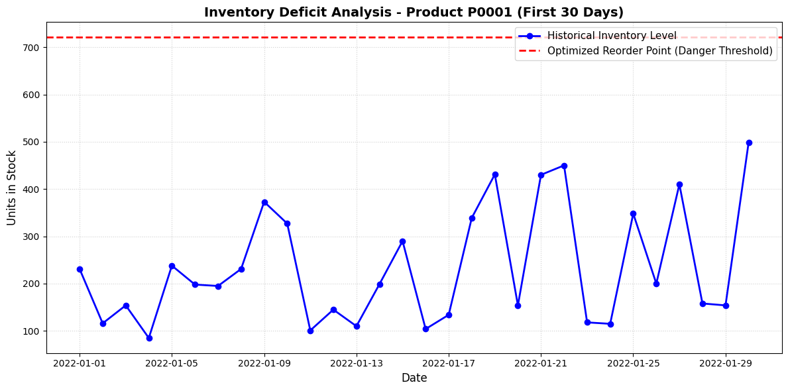

# Retail Inventory Optimization & Deficit Analysis Tool

An analytical Industrial Engineering framework built in Python to evaluate, optimize, and simulate inventory replenishment strategies. This tool processes historical retail operational records to transition supply chains from static stocking levels to dynamic, demand-weighted asset management.

## 📊 Business Problem & Operational Insights
During exploratory data analysis of a retail dataset containing over 73,000 rows of daily entries, a structural system vulnerability was uncovered:
* **The Symptom:** The operational model suffered from **369 severe daily stock-out events** where customer demand dropped physical store shelf levels to absolute zero.
* **The Root Cause Analysis (RCA):** By engineering a custom automated gap analysis script, historical inventory records were compared against statistically safe inventory boundaries. The diagnosis revealed that historical store stocking levels sat below the required safe threshold **100.00% of the time**, proving the business was operating under a chronic inventory deficit due to unmodeled demand volatility ($\sigma_d \approx 109$).

---

## 🛠️ Tech Stack & Mathematical Modeling
* **Language/Environment:** Python 3.13+, Jupyter Notebooks
* **Data Core:** Pandas, NumPy
* **Statistical Modeling:** SciPy (Normal Distribution Mapping)
* **Data Visualization:** Matplotlib

### Core Operations Research Formulas Implemented:

1. **Safety Stock ($SS$):** Calculates the buffer required to protect operations against demand spikes during replenishment cycles using an industry-standard 95% service level ($Z = 1.65$) and a 3-day supplier lead time ($L = 3$).
   $$SS = Z \times \sigma_d \times \sqrt{L}$$

2. **Reorder Point ($ROP$):** Establishes the exact operational inventory floor that triggers a warehouse replenishment request.
   $$ROP = (\text{Average Daily Sales} \times L) + SS$$

3. **Target Stock Level ($Base\ Stock$):** Defines the optimal maximum capacity target to close operational deficits.
   $$\text{Target Stock} = (\text{Average Daily Sales} \times L) + SS$$

---

## 📈 Operational Optimization Metrics

| Metric Analyzed | Baseline Historical Operations | Optimized Framework Target | Operational Significance |
| :--- | :--- | :--- | :--- |
| **Daily Stock Deficit** | 0 Units Buffer (Static) | **+446.2 Units / SKU** (Avg) | Bridges the daily demand volatility gap |
| **Critical Stock-outs** | 369 Outages | **0 Outages** (Simulated) | Prevents lost revenue and customer attrition |
| **Safety ROP Threshold** | Fixed / Unmonitored | **~715 to 721 Units** | Triggers automated replenishment signals |
| **Capital Investment** | Underfunded Capacity | **+$4,892,490.95** (Working Capital)| Evaluates the true financial holding cost trade-off |

### Historical Deficit Visualization
Below is a 30-day simulation tracking historical stock profiles against the engineered safety threshold:

